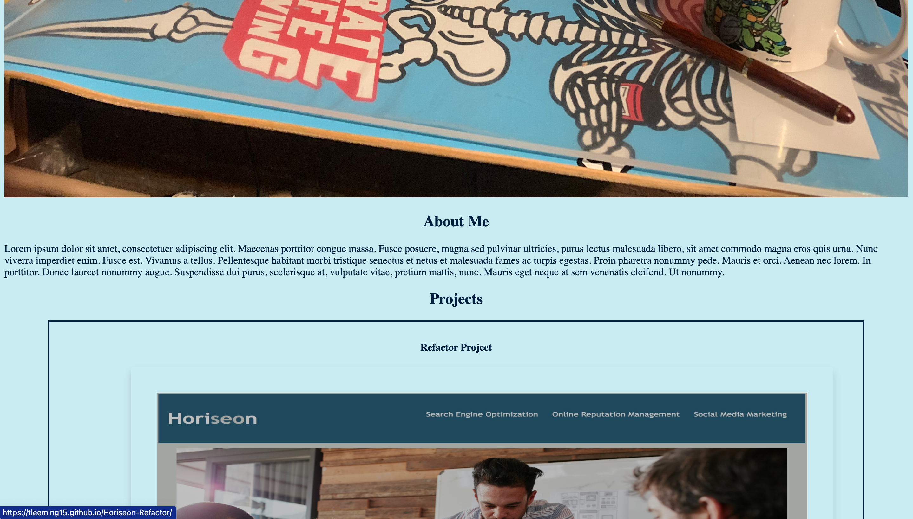
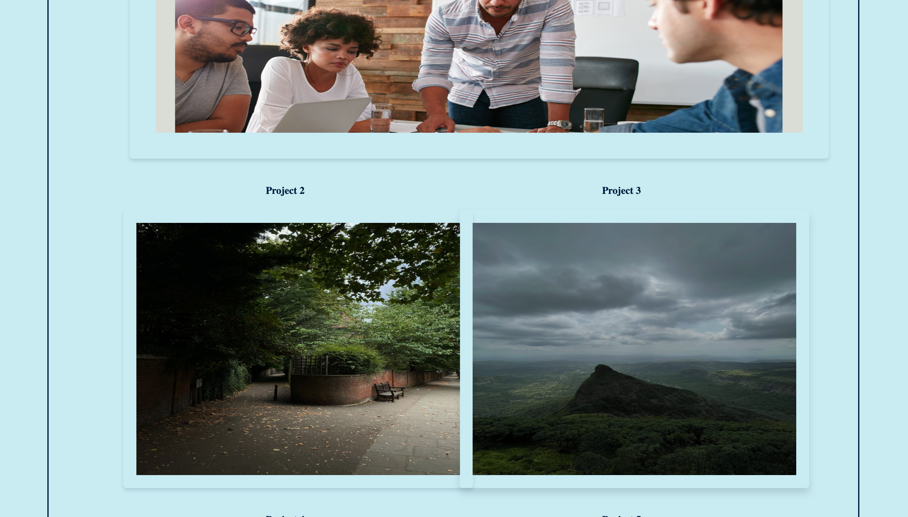
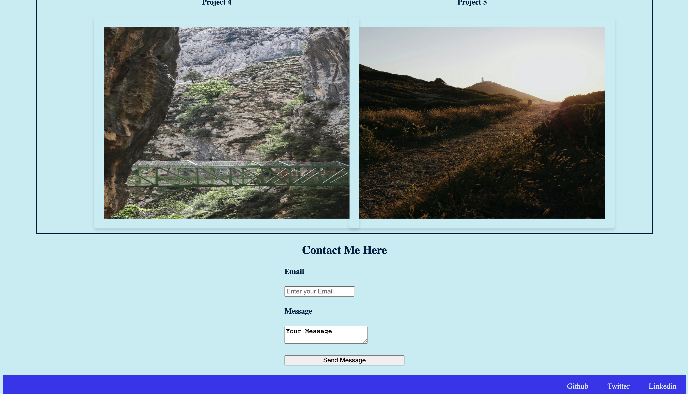

# My Portfolio

## Description

This will be an ongoing project as I continue to learn and develp in this profession. This will be a place where I showcase my skills both in the code of the website itself and with the links in the "Projects" section. As I learn new skills I will apply them to the functionality and appearance of the site. Likewise, as I continue to work on projects I will continually update this website to show my latest and best work. This is my first attmpt to build a site from scratch. The site was developed with the following User Story:

### AS AN employer
* I WANT to view a potential employee's deployed portfolio of work samples
SO THAT I can review samples of their work and assess whether they're a good candidate for an open position

## Problems Solved
This website adheres to accessibility standards and is also responsive to different size devices. There are both internal and external links to help navigate the website and beyond. The acceptanec criteria that the website completes are as follows:

* GIVEN I need to sample a potential employee's previous work
* WHEN I load their portfolio
* THEN I am presented with the developer's name, a recent photo or avatar, and links to sections about them, their work, and how to contact them
* WHEN I click one of the links in the navigation
* THEN the UI scrolls to the corresponding section
* WHEN I click on the link to the section about their work
* THEN the UI scrolls to a section with titled images of the developer's applications
* WHEN I am presented with the developer's first application
* THEN that application's image should be larger in size than the others
* WHEN I click on the images of the applications
* THEN I am taken to that deployed application
* WHEN I resize the page or view the site on various screens and devices
* THEN I am presented with a responsive layout that adapts to my viewport

## Usage

The following images show the completed website. You can visit the site by clicking [here.](https://tleeming15.github.io/my-portfolio/)

 

## Installation

N/A

## License

MIT

